# 📱 Gaari Haat - Vehicle Marketplace Mobile App

<div align="center">


### 🎯 Part of a Complete Full-Stack Vehicle Marketplace Ecosystem

**⚡ Backend API** → [View Repository](https://github.com/mh-rabbi/Backend-eCommerce-Solution-of-used-Car-bike)  
**🖥️ Admin Portal** → [View Repository](https://github.com/mh-rabbi/Admin-Portal-eCommerce-solution-for-used-car-bike)  
**📱 Mobile App** → *You are here!*

---

*A beautiful, feature-rich mobile application for buying and selling used cars and bikes with real-time updates, secure payments, and seamless user experience.*

[](https://github.com/mh-rabbi/releases)
[](https://play.google.com/store)

</div>

---

## 📋 Table of Contents

- [🌟 Features](#-features)
- [📸 Screenshots](#-screenshots)
- [🏗️ Architecture](#️-architecture)
- [🛠️ Tech Stack](#️-tech-stack)
- [📦 Installation](#-installation)
- [⚙️ Configuration](#️-configuration)
- [🚀 Running the App](#-running-the-app)
- [🎨 UI/UX Highlights](#-uiux-highlights)
- [🔌 Real-time Features](#-real-time-features)
- [💳 Payment Integration](#-payment-integration)
- [🗂️ Project Structure](#️-project-structure)
- [🧪 Testing](#-testing)
- [📦 Building for Release](#-building-for-release)
- [🤝 Contributing](#-contributing)
- [📄 License](#-license)

---

## 🌟 Features

### 🎯 Core Features

- ✅ **Beautiful Material Design 3 UI**
  - Modern, responsive interface with smooth animations
  - Custom theme with gradient effects
  - Dark mode support (coming soon)
  - Adaptive layouts for all screen sizes

- 🔐 **Secure Authentication**
  - Email/Password login and registration
  - JWT token-based authentication
  - Secure token storage with SharedPreferences
  - Auto-logout on token expiration

- 🚗 **Vehicle Marketplace**
  - Browse thousands of cars and bikes
  - Advanced search and filtering
  - Filter by type (Car/Bike)
  - Price range filtering
  - Real-time search with instant results
  - Image gallery with smooth transitions

- 📝 **Post Your Vehicle**
  - Easy-to-use vehicle posting form
  - Multiple image upload (up to 10 images)
  - Image picker from camera or gallery
  - Real-time validation
  - Instant platform fee calculation

- 💳 **Integrated Payment System**
  - SSLCommerz payment gateway integration
  - Secure payment processing
  - Platform fee calculation (8% for cars, 5% for bikes)
  - Payment status tracking
  - Invoice generation (PDF)

- ❤️ **Favorites & Wishlist**
  - Save favorite vehicles
  - Quick access to saved listings
  - Sync across sessions
  - Real-time favorite status

- 👤 **Rich User Profiles**
  - Profile image upload
  - Complete profile management
  - Address and contact information
  - Edit profile with validation

- 📊 **My Posts Management**
  - View all your vehicle listings
  - Track status (Pending/Approved/Rejected/Sold)
  - Mark vehicles as sold
  - Payment history for each listing
  - Filter by status

- 📈 **Sell History**
  - Complete sales history
  - Total earnings calculation
  - Sales statistics
  - Success metrics

- 🔔 **Real-time Updates**
  - WebSocket integration with Socket.IO
  - Instant notifications for vehicle approvals
  - Live status updates
  - Connection status monitoring

- 🎨 **Premium Animations**
  - Smooth page transitions
  - Staggered list animations
  - Hero animations for images
  - Loading shimmer effects
  - Micro-interactions throughout

### 🎨 Additional Features

- 📱 **Contact Seller**
  - Direct phone call integration
  - Email communication
  - WhatsApp integration
  - Seller profile view

- 🔍 **Advanced Search**
  - Real-time search results
  - Search by title, brand, description
  - Combined with filters
  - Search history (coming soon)

- 📄 **PDF Invoice Generation**
  - Generate professional invoices
  - Share via email or apps
  - Download to device
  - Complete payment details

- 🆘 **Support System**
  - FAQ section
  - Contact support via email
  - Help documentation
  - Safety tips

- 🌐 **Offline Support**
  - Cache favorite data
  - Offline mode (coming soon)
  - Sync on reconnection

---

## 📸 Screenshots

<div align="center">

### 🎨 Onboarding & Authentication

<table>
  <tr>
    <td>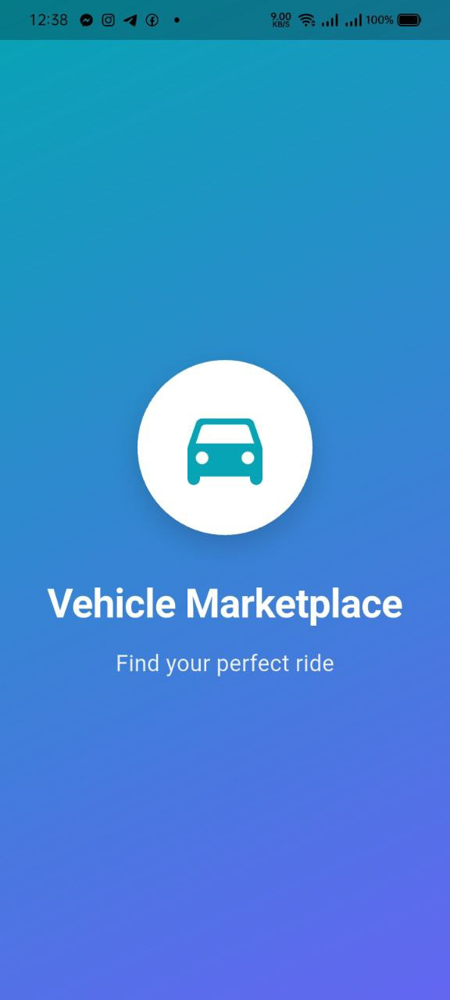<br/><sub><b>Splash Screen</b></sub></td>
    <td>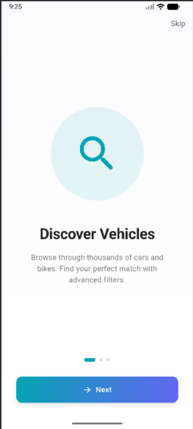<br/><sub><b>Onboarding 1</b></sub></td>
    <td>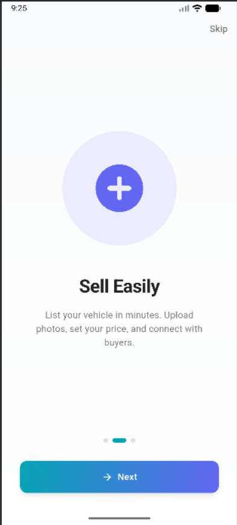<br/><sub><b>Onboarding 2</b></sub></td>
    <td><br/><sub><b>Onboarding 3</b></sub></td>
    <td>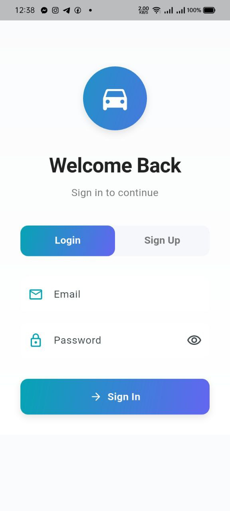<br/><sub><b>Login</b></sub></td>
  </tr>
</table>

### 🏠 Home & Browse

<table>
  <tr>
    <td>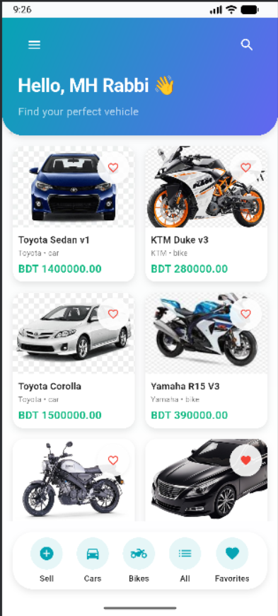<br/><sub><b>Home Screen</b></sub></td>
    <td><br/><sub><b>Search Active</b></sub></td>
    <td>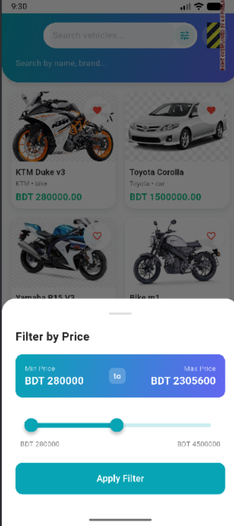<br/><sub><b>Price Filter</b></sub></td>
    <td>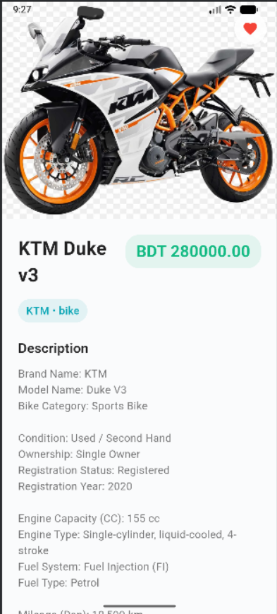<br/><sub><b>Vehicle Details</b></sub></td>
    <td>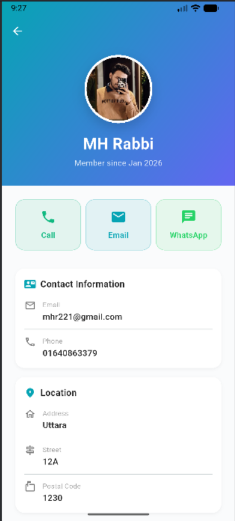<br/><sub><b>Seller Profile</b></sub></td>
  </tr>
</table>

### 📝 Post Vehicle & Payment

<table>
  <tr>
    <td>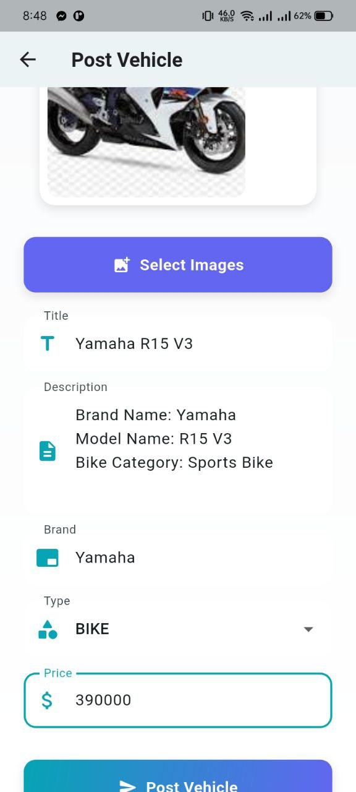<br/><sub><b>Post Vehicle</b></sub></td>
    <td><br/><sub><b>Image Upload</b></sub></td>
    <td>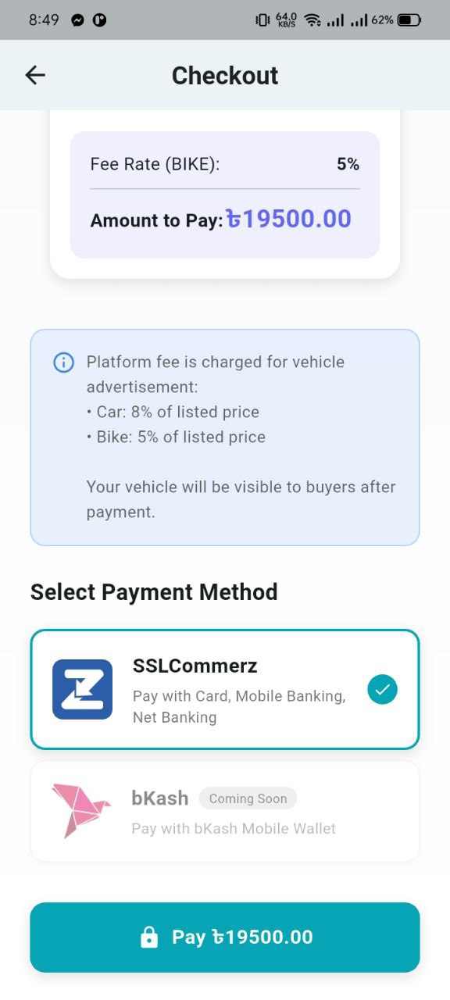<br/><sub><b>Checkout</b></sub></td>
    <td>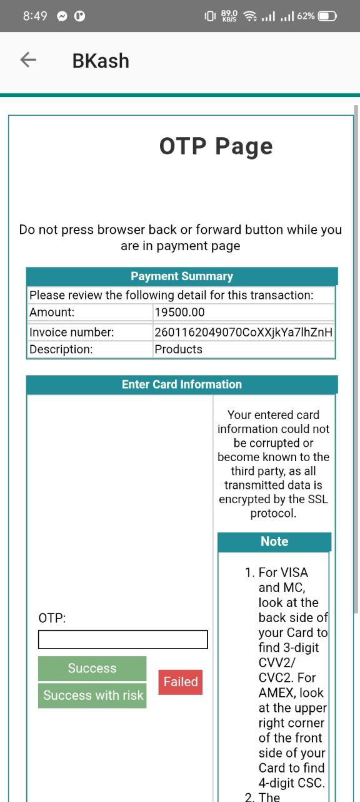<br/><sub><b>Payment Gateway</b></sub></td>
    <td><br/><sub><b>Payment Success</b></sub></td>
  </tr>
</table>

### 👤 Profile & Management

<table>
  <tr>
    <td><br/><sub><b>User Profile</b></sub></td>
    <td>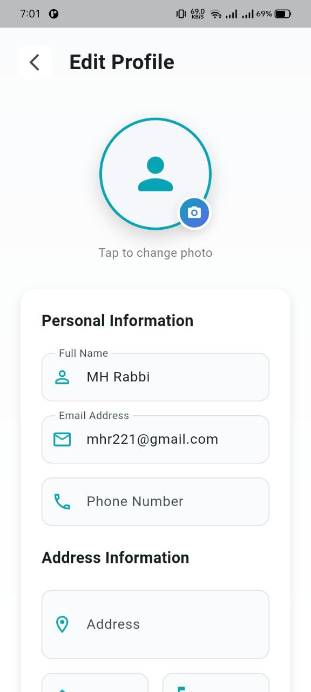<br/><sub><b>Edit Profile</b></sub></td>
    <td>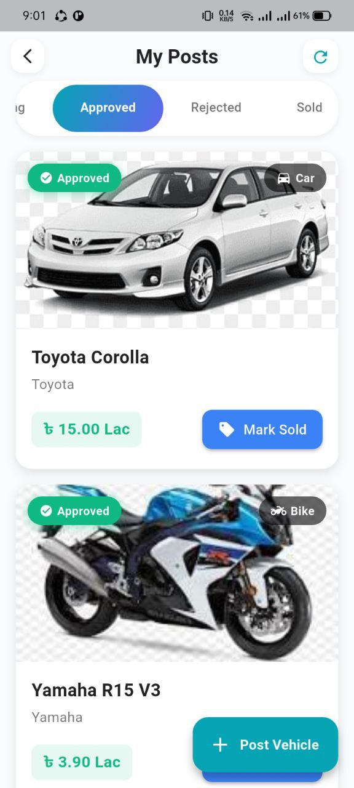<br/><sub><b>My Posts</b></sub></td>
    <td><br/><sub><b>Payment Details</b></sub></td>
    <td>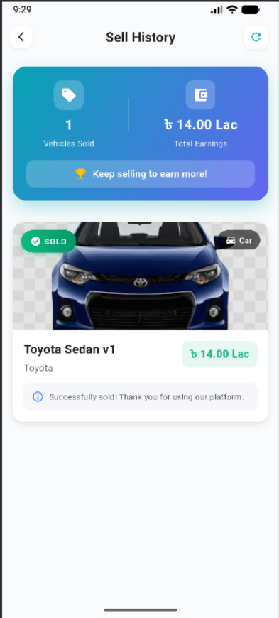<br/><sub><b>Sell History</b></sub></td>
  </tr>
</table>

### ❤️ Favorites & Support

<table>
  <tr>
    <td>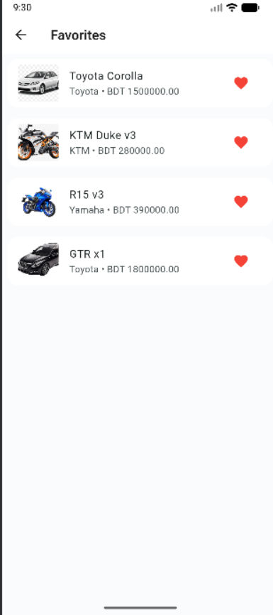<br/><sub><b>Favorites</b></sub></td>
    <td>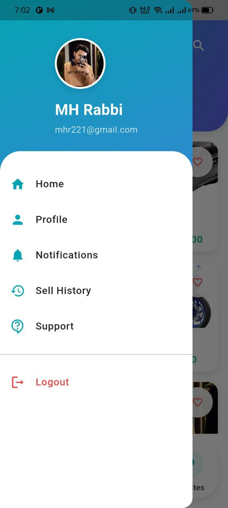<br/><sub><b>Navigation Drawer</b></sub></td>
    <td>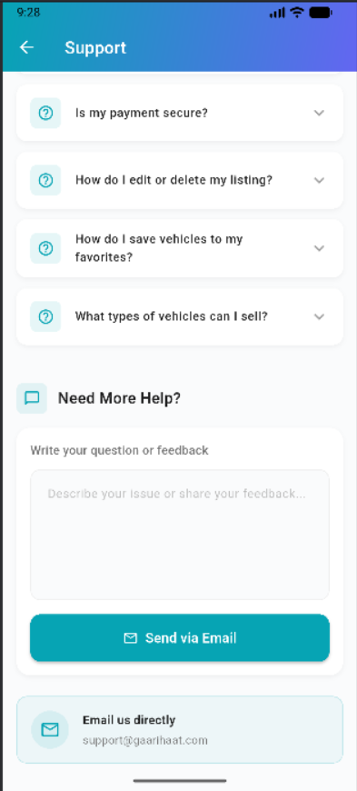<br/><sub><b>Support Center</b></sub></td>
    <td>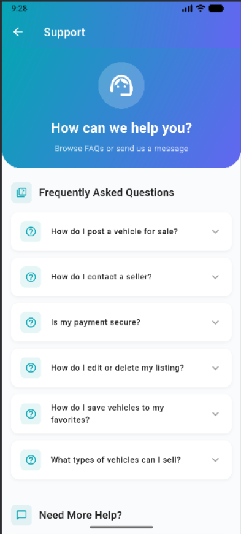<br/><sub><b>FAQ Section</b></sub></td>
    <td><br/><sub><b>Loading States</b></sub></td>
  </tr>
</table>

</div>

---

## 🏗️ Architecture

### Design Pattern: **GetX (MVC)**

```
┌─────────────────────────────────────────────────────────────┐
│                    Mobile App Architecture                    │
├─────────────────────────────────────────────────────────────┤
│                                                               │
│  📱 Views (UI Layer)                                         │
│  └── Stateless/Stateful Widgets                             │
│       ├── Premium animations                                 │
│       ├── Material Design 3                                  │
│       └── Responsive layouts                                 │
│                                                               │
│  🎮 Controllers (Business Logic)                             │
│  └── GetX Controllers                                        │
│       ├── AuthController                                     │
│       ├── VehicleController                                  │
│       ├── FavoriteController                                 │
│       ├── PaymentController                                  │
│       └── State management                                   │
│                                                               │
│  🔧 Services (Data Layer)                                    │
│  └── API Communication                                       │
│       ├── ApiService (HTTP)                                  │
│       ├── SocketService (WebSocket)                          │
│       ├── AuthService                                        │
│       ├── VehicleService                                     │
│       ├── PaymentService                                     │
│       └── UserService                                        │
│                                                               │
│  📦 Models (Data Models)                                     │
│  └── Data structures                                         │
│       ├── User                                               │
│       ├── Vehicle                                            │
│       ├── Payment                                            │
│       └── JSON serialization                                 │
│                                                               │
│  🎨 Core (Shared Resources)                                  │
│  └── Reusable components                                     │
│       ├── Theme & styling                                    │
│       ├── Widgets                                            │
│       ├── Animations                                         │
│       └── Constants                                          │
│                                                               │
└─────────────────────────────────────────────────────────────┘

                          ⬇️  ⬆️

┌─────────────────────────────────────────────────────────────┐
│                    Backend API (NestJS)                       │
│  RESTful API + WebSocket for real-time updates              │
└─────────────────────────────────────────────────────────────┘
```

---

## 🛠️ Tech Stack

### Core Framework
- **[Flutter](https://flutter.dev/)** v3.24+ - Google's UI toolkit for beautiful apps
- **[Dart](https://dart.dev/)** v3.9+ - Modern programming language

### State Management
- **[GetX](https://pub.dev/packages/get)** v4.6.6 - State management, navigation, and dependency injection

### Networking
- **[HTTP](https://pub.dev/packages/http)** v1.2.2 - RESTful API communication
- **[Dio](https://pub.dev/packages/dio)** v5.4.3 - Advanced HTTP client with interceptors
- **[Socket.IO Client](https://pub.dev/packages/socket_io_client)** v2.0.3 - Real-time WebSocket

### Local Storage
- **[SharedPreferences](https://pub.dev/packages/shared_preferences)** v2.3.2 - Key-value storage for tokens and user data

### Media & Images
- **[Image Picker](https://pub.dev/packages/image_picker)** v1.1.2 - Camera and gallery access
- **[Cached Network Image](https://pub.dev/packages/cached_network_image)** v3.4.1 - Optimized image loading and caching

### Animations
- **[Flutter Animate](https://pub.dev/packages/flutter_animate)** v4.5.0 - Powerful animations library
- **[Flutter Staggered Animations](https://pub.dev/packages/flutter_staggered_animations)** v1.1.1 - List animations
- **[Animations](https://pub.dev/packages/animations)** v2.0.11 - Material motion animations
- **[Shimmer](https://pub.dev/packages/shimmer)** v3.0.0 - Loading placeholder effects

### Payment Gateway
- **[Flutter SSLCommerz](https://pub.dev/packages/flutter_sslcommerz)** v3.0.1 - Bangladesh's leading payment gateway

### Document Generation
- **[PDF](https://pub.dev/packages/pdf)** v3.11.0 - PDF creation
- **[Printing](https://pub.dev/packages/printing)** v5.13.0 - PDF printing and sharing
- **[Intl](https://pub.dev/packages/intl)** v0.19.0 - Date formatting

### Utilities
- **[URL Launcher](https://pub.dev/packages/url_launcher)** v6.2.1 - Open external URLs, phone, email
- **[Flutter SVG](https://pub.dev/packages/flutter_svg)** v2.0.10 - SVG rendering

### Development Tools
- **[Flutter Lints](https://pub.dev/packages/flutter_lints)** v6.0.0 - Recommended lints
- **[Flutter Launcher Icons](https://pub.dev/packages/flutter_launcher_icons)** v0.13.1 - App icon generation

---

## 📦 Installation

### Prerequisites

- Flutter SDK (v3.24 or higher)
- Dart SDK (v3.9 or higher)
- Android Studio / VS Code with Flutter extensions
- Xcode (for iOS development on macOS)
- A physical device or emulator

### Verify Flutter Installation

```bash
flutter doctor
```

### Steps

1. **Clone the repository**
   ```bash
   git clone https://github.com/mh-rabbi/eCommerce-solution-for-used-car-bike.git
   cd eCommerce-solution-for-used-car-bike
   ```

2. **Install dependencies**
   ```bash
   flutter pub get
   ```

3. **Generate app icons** (optional)
   ```bash
   flutter pub run flutter_launcher_icons
   ```

4. **Run the app**
   ```bash
   # For Android
   flutter run

   # For iOS
   flutter run -d ios

   # For a specific device
   flutter devices  # List available devices
   flutter run -d <device-id>
   ```

---

## ⚙️ Configuration

### Backend API Configuration

Update the base URL in `lib/config/app_config.dart`:

```dart
class AppConfig {
  // For Android Emulator
  static const String androidEmulatorBaseUrl = 'http://10.0.2.2:3000';

  // For Physical Device (use your computer's local IP)
  static const String physicalDeviceBaseUrl = 'http://192.168.0.140:3000';

  // For iOS Simulator
  static const String iosSimulatorBaseUrl = 'http://localhost:3000';

  // ACTIVE BASE URL - Change this based on where you're running
  static const String baseUrl = physicalDeviceBaseUrl; // ← Change this
}
```

### Finding Your Local IP Address

**Windows:**
```bash
ipconfig
# Look for IPv4 Address under your active network adapter
```

**macOS/Linux:**
```bash
ifconfig
# Look for inet under your active network interface
```

### SSLCommerz Configuration

For payment integration, update credentials in `lib/views/checkout/checkout_view.dart`:

```dart
Sslcommerz sslcommerz = Sslcommerz(
  initializer: SSLCommerzInitialization(
    // ...
    store_id: "your_store_id",        // ← Replace
    store_passwd: "your_store_password", // ← Replace
    sdkType: SSLCSdkType.TESTBOX,     // Change to LIVE for production
  ),
);
```

### App Configuration Options

In `lib/config/app_config.dart`, you can customize:

```dart
// Request timeout
static const Duration requestTimeout = Duration(seconds: 30);

// Upload timeout
static const Duration uploadTimeout = Duration(minutes: 2);

// Max image upload size (10MB)
static const int maxImageUploadSize = 10 * 1024 * 1024;

// Max images per vehicle
static const int maxImagesPerVehicle = 10;

// Debug mode
static const bool isDebugMode = true; // Set to false in production
```

---

## 🚀 Running the App

### Development Mode

```bash
# Run with hot reload
flutter run

# Run in debug mode with logging
flutter run --verbose

# Run on specific device
flutter run -d <device-id>
```

### Build for Testing

```bash
# Android APK (debug)
flutter build apk --debug

# iOS (debug)
flutter build ios --debug
```

### Clear Cache and Rebuild

```bash
flutter clean
flutter pub get
flutter run
```

---

## 🎨 UI/UX Highlights

### Design Philosophy

- **Material Design 3** - Latest design system from Google
- **Smooth Animations** - 60fps animations throughout
- **Gesture-based Navigation** - Intuitive swipes and taps
- **Responsive Layouts** - Adapts to all screen sizes
- **Consistent Theming** - Unified color palette and typography

### Theme System

Located in `lib/core/theme/app_theme.dart`:

```dart
// Primary Colors
static const Color primary = Color(0xFF06A4B4);
static const Color accent = Color(0xFF6366F1);

// Gradients
static const LinearGradient primaryGradient = LinearGradient(
  begin: Alignment.topLeft,
  end: Alignment.bottomRight,
  colors: [primary, accent],
);

// Shadows
static List<BoxShadow> shadow1 = [...]; // Subtle
static List<BoxShadow> shadow2 = [...]; // Medium
static List<BoxShadow> shadow3 = [...]; // Strong
```

### Custom Widgets

**Reusable Components:**
- `AnimatedButton` - Interactive button with scale animation
- `AnimatedCard` - Card with stagger animation
- `ShimmerLoading` - Loading placeholders
- `EmptyState` - Beautiful empty state screens
- `PageTransition` - Custom route transitions

### Animation System

Using `flutter_animate` for declarative animations:

```dart
Widget.animate()
  .fadeIn(duration: 400.ms)
  .slideY(begin: 0.2, end: 0)
  .shimmer(delay: 200.ms);
```

---

## 🔌 Real-time Features

### WebSocket Integration

The app uses Socket.IO for real-time updates:

```dart
// Service: lib/services/socket_service.dart
class SocketService extends GetxService {
  // Connect to backend WebSocket
  void connect() {
    _socket = io.io('${AppConfig.baseUrl}/vehicles', {
      'transports': ['websocket', 'polling'],
      'autoConnect': true,
    });
  }
}
```

### Real-time Events

The app listens for and responds to:

- `vehicle:approved` - When admin approves a vehicle
- `vehicle:rejected` - When admin rejects a vehicle
- `vehicle:created` - New vehicle posted
- `vehicle:updated` - Vehicle details updated
- `vehicle:sold` - Vehicle marked as sold
- `vehicle:deleted` - Vehicle removed

### Benefits

- ✅ Instant marketplace updates
- ✅ No manual refresh needed
- ✅ Better user experience
- ✅ Real-time notifications

---

## 💳 Payment Integration

### SSLCommerz Flow

```
1. User posts vehicle
   ↓
2. App calculates platform fee
   ↓
3. User proceeds to checkout
   ↓
4. SSLCommerz payment gateway opens
   ↓
5. User completes payment
   ↓
6. Backend receives IPN callback
   ↓
7. Vehicle status updated to APPROVED
   ↓
8. Vehicle appears in marketplace
```

### Platform Fees

| Vehicle Type | Platform Fee |
|--------------|--------------|
| Car | 8% of listing price |
| Bike | 5% of listing price |

### Payment Methods Supported

- 💳 Credit/Debit Cards (Visa, Mastercard)
- 📱 Mobile Banking (bKash, Nagad, Rocket)
- 🏦 Net Banking
- 💰 Mobile Wallets

### Security

- ✅ PCI-DSS compliant payment gateway
- ✅ Encrypted transactions
- ✅ Secure token storage
- ✅ No card details stored in app

---

## 🗂️ Project Structure

```
lib/
├── config/
│   └── app_config.dart              # App-wide configuration
├── controllers/
│   ├── auth_controller.dart         # Authentication logic
│   ├── vehicle_controller.dart      # Vehicle management
│   ├── favorite_controller.dart     # Favorites logic
│   └── payment_controller.dart      # Payment handling
├── core/
│   ├── theme/
│   │   └── app_theme.dart          # Theme configuration
│   └── widgets/
│       ├── animated_button.dart     # Custom button
│       ├── animated_card.dart       # Custom card
│       ├── empty_state.dart         # Empty state widget
│       ├── shimmer_loading.dart     # Loading skeletons
│       └── page_transition.dart     # Route transitions
├── models/
│   ├── user.dart                    # User model
│   ├── vehicle.dart                 # Vehicle model
│   └── payment.dart                 # Payment model
├── routes/
│   └── app_routes.dart              # Navigation routes
├── services/
│   ├── api_service.dart             # HTTP client
│   ├── auth_service.dart            # Auth API calls
│   ├── vehicle_service.dart         # Vehicle API calls
│   ├── payment_service.dart         # Payment API calls
│   ├── user_service.dart            # User API calls
│   ├── favorite_service.dart        # Favorites API calls
│   ├── socket_service.dart          # WebSocket client
│   └── pdf_service.dart             # PDF generation
├── views/
│   ├── splash/                      # Splash screen
│   ├── onboarding/                  # Onboarding screens
│   ├── login/                       # Login/Register
│   ├── home/                        # Home screen
│   ├── vehicle_detail/              # Vehicle details
│   ├── post_vehicle/                # Post vehicle form
│   ├── checkout/                    # Payment checkout
│   ├── profile/                     # User profile
│   ├── my_posts/                    # My vehicle posts
│   ├── sell_history/                # Sold vehicles
│   ├── favorites/                   # Favorite vehicles
│   ├── seller_profile/              # Seller info
│   └── support/                     # Help & support
└── main.dart                        # App entry point
```

---

## 🧪 Testing

### Running Tests

```bash
# Run all tests
flutter test

# Run tests with coverage
flutter test --coverage

# Run specific test file
flutter test test/services/api_service_test.dart
```

### Test Categories

- **Unit Tests** - Testing individual functions and classes
- **Widget Tests** - Testing UI components
- **Integration Tests** - Testing complete features

### Writing Tests

Example test structure:

```dart
// test/services/api_service_test.dart
import 'package:flutter_test/flutter_test.dart';
import 'package:vehicle_marketplace/services/api_service.dart';

void main() {
  group('ApiService', () {
    test('should fetch vehicles successfully', () async {
      // Arrange
      final apiService = ApiService();
      
      // Act
      final vehicles = await apiService.get('/vehicles');
      
      // Assert
      expect(vehicles, isNotNull);
    });
  });
}
```

---

## 📦 Building for Release

### Android Release Build

1. **Configure signing** in `android/app/build.gradle`

2. **Build APK**
   ```bash
   flutter build apk --release
   ```

3. **Build App Bundle** (for Play Store)
   ```bash
   flutter build appbundle --release
   ```

4. **Find output**
   ```
   build/app/outputs/flutter-apk/app-release.apk
   build/app/outputs/bundle/release/app-release.aab
   ```

### iOS Release Build

1. **Update version** in `pubspec.yaml`

2. **Build IPA**
   ```bash
   flutter build ios --release
   ```

3. **Archive in Xcode**
   - Open `ios/Runner.xcworkspace` in Xcode
   - Select "Any iOS Device"
   - Product → Archive
   - Distribute to App Store

### Version Management

Update in `pubspec.yaml`:
```yaml
version: 1.0.0+1  # version_name+build_number
```

---

## 🎯 Performance Optimization

### Implemented Optimizations

- ✅ Image caching with `cached_network_image`
- ✅ Lazy loading for lists
- ✅ Efficient state management with GetX
- ✅ Debounced search inputs
- ✅ Optimized image uploads with compression
- ✅ Minimal rebuilds with Obx

### Best Practices

```dart
// Use const constructors
const Text('Hello');

// Lazy load images
CachedNetworkImage(
  imageUrl: url,
  placeholder: (context, url) => ShimmerLoading(),
);

// Dispose controllers
@override
void dispose() {
  controller.dispose();
  super.dispose();
}
```

---

## 🔧 Troubleshooting

### Common Issues

**1. Network Error - Can't connect to backend**
```
Solution: Update baseUrl in app_config.dart with your computer's IP
```

**2. Image upload fails**
```
Solution: Check CORS settings in backend, verify file size < 10MB
```

**3. Token expired errors**
```
Solution: Backend JWT secret must match. Restart backend after changing .env
```

**4. Build fails after adding dependencies**
```
Solution: Run flutter clean && flutter pub get
```

**5. Socket connection fails**
```
Solution: Check backend WebSocket server is running, verify URL
```

---

## 🌟 Features Coming Soon

- [ ] Push notifications
- [ ] Dark mode support
- [ ] In-app chat with sellers
- [ ] Vehicle comparison feature
- [ ] Advanced filters (year, mileage, etc.)
- [ ] Social media sharing
- [ ] Rate and review system
- [ ] Saved searches
- [ ] Price alerts
- [ ] Multiple language support

---

## 🤝 Contributing

We welcome contributions! Please follow these steps:

1. Fork the repository
2. Create a feature branch (`git checkout -b feature/AmazingFeature`)
3. Commit your changes (`git commit -m 'Add some AmazingFeature'`)
4. Push to the branch (`git push origin feature/AmazingFeature`)
5. Open a Pull Request

### Coding Standards

- Follow [Effective Dart](https://dart.dev/guides/language/effective-dart) guidelines
- Use meaningful variable names
- Write comments for complex logic
- Format code: `flutter format .`
- Analyze code: `flutter analyze`

---

## 📝 Changelog

### Version 1.0.0 (Current)

- ✅ Initial release
- ✅ User authentication
- ✅ Vehicle marketplace
- ✅ Post vehicle functionality
- ✅ Payment integration (SSLCommerz)
- ✅ Real-time updates via WebSocket
- ✅ Favorites system
- ✅ Profile management
- ✅ My posts management
- ✅ Sell history tracking
- ✅ PDF invoice generation
- ✅ Support center

---

## 🐛 Known Issues

- Search animation may lag on older devices (< Android 8)
- PDF sharing may not work on some custom Android ROMs
- Image picker may require storage permission on first use

Report issues at: [GitHub Issues](https://github.com/mh-rabbi/eCommerce-solution-for-used-car-bike/issues)

---

## 📄 License

This project is licensed under the ISC License - see the LICENSE file for details.

---

## 👨‍💻 Author

**MH Rabbi**

- GitHub: [@mh-rabbi](https://github.com/mh-rabbi)
- LinkedIn: [Your LinkedIn Profile](https://linkedin.com/in/yourprofile)
- Email: your.email@example.com

---

## 🙏 Acknowledgments

- Flutter team for the amazing framework
- GetX team for excellent state management
- SSLCommerz for payment gateway integration
- All open-source contributors

---

## 📞 Support

For questions or support:
- 📧 Email: support@gaarihaat.com
- 💬 Discord: [Join our server](https://discord.gg/yourinvite)
- 📖 Documentation: [View docs](https://docs.gaarihaat.com)

---

<div align="center">

### ⭐ Star this repository if you find it helpful! ⭐

**Built with ❤️ using Flutter**

[](https://github.com/mh-rabbi/eCommerce-solution-for-used-car-bike)
[](https://github.com/mh-rabbi/eCommerce-solution-for-used-car-bike)

</div>

---

## 🔗 Related Projects

📱 **Mobile App (Flutter)**: [View Repository](https://github.com/mh-rabbi/eCommerce-solution-for-used-car-bike) ← *You are here!*  
⚡ **Backend API (NestJS)**: [View Repository](https://github.com/mh-rabbi/Backend-eCommerce-Solution-of-used-Car-bike)  
🖥️ **Admin Portal (React)**: [View Repository](https://github.com/mh-rabbi/Admin-Portal-eCommerce-solution-for-used-car-bike)

---

*Last Updated: February 2026*
